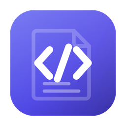
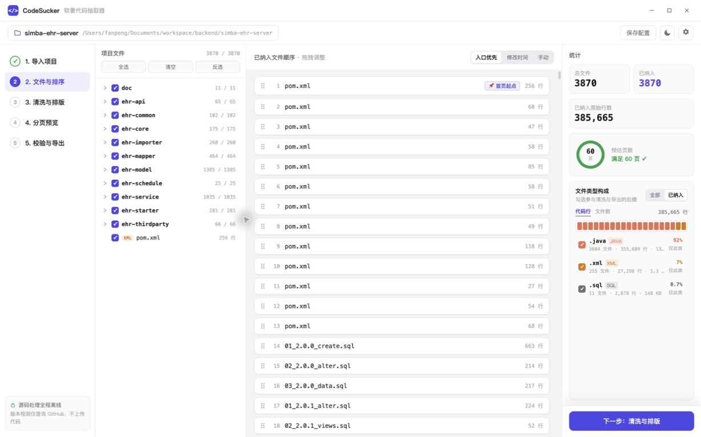

<div align="center">



# CodeSucker · 软著代码抽取器

**把任意本地代码项目一键整理成符合中国软件著作权申报规范的源程序文档**

全程离线 · 代码不出本机 · 规范内置 · 导出前自动校验

[](LICENSE)
[](#快速开始)
[](https://www.electronjs.org/)
[](#参与贡献)

<br/>



</div>

---

## 为什么做这个

申请软件著作权登记时，需要提交**源程序鉴别材料**：前后各连续 30 页、每页不少于 50 行、页眉标注软件全称+版本号……格式细节繁多，一处不合就被退回补正。手工整理一次要花几个小时，而市面上的工具要么只做简单拼接、要么依赖在线服务（代码泄露风险）。

CodeSucker 把《计算机软件著作权登记办法》和版权保护中心的实际审查口径**内置成规则引擎**：导入项目 → 五步向导 → 导出即合规，并在导出前自动跑一遍合规校验，把"退回风险"消灭在提交前。

## 功能特性

- 🗂 **智能文件发现** — 递归扫描项目，自动排除 `node_modules`/`build`/`.git` 等目录，尊重 `.gitignore`，自动识别 GBK/UTF-8 编码
- 🧹 **Token 级代码清洗** — 带字符串状态机的注释剥离（`"https://..."` 里的 `//` 不会被误删），支持 Java/Kotlin/Python/JS/TS/Go/Rust/C/C++/C#/Swift/PHP/Ruby/Vue/HTML/CSS/SQL 等 30+ 后缀；删空行、Tab 转空格、超长行按 78 列硬折断
- 🔒 **敏感信息脱敏** — API 密钥、密码、内网 IP、手机号自动替换为占位符
- 📄 **规范化截取分页** — 超 3000 行自动取前 1500 + 后 1500 行；第 1 页必为模块开头、第 60 页必为模块结尾；每 50 行显式分页符，不靠排版"凑页"
- 📝 **一键导出** — docx（页眉=软件名+版本号、右上角自动页码、宋体 10.5pt 固定行距）+ txt 备查
- ✅ **提交前合规校验** — 每页行数、末页 2/3、页眉一致性、`@author`/`Copyright` 署名冲突、HTML+CSS 占比、文件时间早于成立日期等 8 项检查，给出「通过 / 警告 / 退回风险」三级结论
- 🔐 **完全离线** — 扫描、清洗、排版、导出零网络请求，源代码永远不离开本机
- 💾 **配置持久化** — 项目配置存入 `.codesucker.json`，重复申报一键复现

## 内置申报规范对照

| 规范要求 | CodeSucker 的实现 |
|---|---|
| 前、后各连续 30 页，共 60 页 | 超 3000 行自动截取前 1500 + 后 1500 行 |
| 每页不少于 50 行 | 内存中按 50 行切块 + 显式分页符，逐页保证 |
| 页眉标注软件全称+版本号 | 导出时写入页眉，未含版本号会在校验中警告 |
| 页码 1–60 连续 | docx PAGE 域自动编号 |
| 第 1 页为程序开头、第 60 页为结尾 | 截取策略从首文件首行起、至末文件末行止 |
| 无空行、注释不凑页 | 清洗阶段删除（可关闭） |
| 末页至少满 2/3 | 校验器检查并提示 |
| 署名与著作权人一致 | 全文扫描 `@author`/`Copyright` 并比对 |

> 依据：[《计算机软件著作权登记办法》](https://www.ncac.gov.cn/xxfb/flfg/bmgz/202410/P020241015604759788122.pdf)及中国版权保护中心公开审查口径。本工具不构成法律建议，最终以登记机构要求为准。

## 快速开始

### 开发运行

```bash
git clone https://github.com/fanbuz/codesucker.git
cd codesucker
npm install
npm run dev        # 启动桌面应用
npm test           # core 流水线冒烟测试
npm run verify     # 版本一致性 + 测试 + 完整构建
```

> **国内网络提示**：Electron 二进制下载失败时执行
> `ELECTRON_MIRROR=https://npmmirror.com/mirrors/electron/ node node_modules/electron/install.js`

### 使用流程

**① 导入项目**（拖入文件夹）→ **② 文件与排序**（勾选纳入、拖拽调序，入口文件置顶）→ **③ 清洗与排版**（填写软件全称+版本号、开关清洗规则、实时前后对比）→ **④ 分页预览**（A4 仿真、60 页缩略导航、前后段分界标记）→ **⑤ 校验与导出**（合规报告 + 生成 docx/txt）

## 架构

```
packages/
  core/     纯 TypeScript 流水线，零 Electron 依赖（未来可复用为 CLI / Web）
            discover → clean → select → render → audit
  app/      Electron 43 + React 18 + zustand（electron-vite 构建）
design/
  prototype/  Claude Design 高保真原型（UI 实现基准）
  icon/       应用图标源文件（SVG）
docs/       功能设计、技术选型与原型 prompt
scripts/    图标生成等工具脚本
```

关键技术决策（详见 [docs/01-功能设计与技术选型.md](docs/01-功能设计与技术选型.md)）：

1. **显式分页而非排版凑页** — 分页符逐页控制，固定行距只作兜底，换字体不错位
2. **注释剥离用逐字符状态机而非正则** — 字符串字面量内的注释符号是正则流派的必错题
3. **截取保证模块边界** — 首页/末页锚定文件首末行，满足审查的"开头/结尾"要求
4. **core 零壳依赖** — 业务全部沉在纯 TS 包，Electron 只做 IO 与窗口

## 常见问题

**Q：生成的文档能直接提交吗？**
能。docx 即为最终鉴别材料格式；建议先看第 5 步校验报告，把「退回风险」项清零。

**Q：老版本 macOS Electron 被系统当恶意软件删除？**
XProtect 会误杀旧版 Electron 的二进制，本项目已固定使用 Electron 43+，若仍遇到请走 npmmirror 重新下载（见上方提示）。

**Q：我的代码会被上传吗？**
不会。全部处理在本机完成，应用零网络请求（更新检查也仅在手动点击时进行）。

## 路线图

- [x] **V1（MVP）**：五段流水线 · 5 步向导 · docx/txt 导出 · 8 项合规校验 · 配置持久化
- [ ] **V2**：electron-builder 三平台安装包 · electron-updater 自动更新（国内 OSS 源）· 自定义排除/脱敏规则 · 校验项一键修复 · CLI 版本
- [ ] **V3**：用户手册/设计说明书模板化生成 · 例外交存模式（黑斜线覆盖）· 多申报主体管理

## 版本与发布

CodeSucker 使用 Semantic Versioning。根包、桌面应用、core 包和 lockfile 的产品版本由统一脚本同步；项目配置 schema 与合规规则版本独立演进。

```bash
npm run version:check                    # 检查所有版本字段一致
npm run version:set -- 0.2.0-beta.1      # 统一设置产品版本
npm run verify                           # 发布前完整校验
```

正式发布以 `v<SemVer>` Git tag 和 GitHub Release 为准，仅修改源码中的版本字段不代表已经发布。完整规则见 [VERSIONING.md](VERSIONING.md)，用户可见变化记录在 [CHANGELOG.md](CHANGELOG.md)。

## 参与贡献

欢迎 Issue 与 PR。提交前请确保 `npm run verify` 通过；提交信息请说明动机而不止是改动内容。

## 许可证

[Apache-2.0](LICENSE) © fanbuz

本项目允许使用、修改、分发及闭源商用；再分发时须附带 Apache-2.0 许可证、保留适用的版权与 [NOTICE](NOTICE) 声明，并标明对文件所作的修改。
