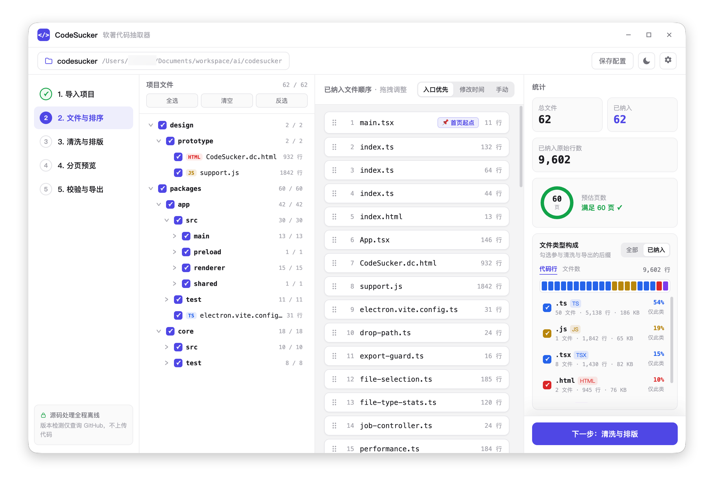
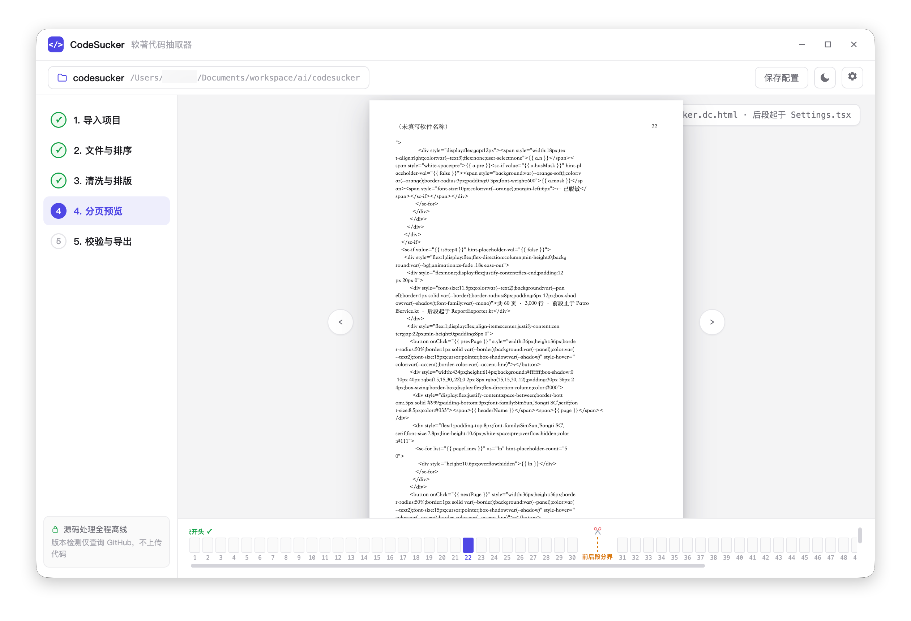

<div align="center">


# CodeSucker · 软著代码抽取器

**把本地代码项目整理成便于软件著作权申报的源程序文档**

全程离线 · 代码不出本机 · 规范内置 · 导出前自动校验

[](LICENSE)
[](https://github.com/fanbuz/codesucker/releases/latest)
[](#下载)
[](https://www.electronjs.org/)
[](#参与贡献)

<br/>



<br/>



</div>

---

## 为什么做这个

申请软件著作权登记时，需要提交**源程序鉴别材料**：前后各连续 30 页、每页不少于 50 行、页眉标注软件全称+版本号……格式细节繁多，一处不合就被退回补正。手工整理一次要花几个小时，而市面上的工具要么只做简单拼接、要么依赖在线服务（代码泄露风险）。

CodeSucker 把常见的软件著作权源程序材料规则整理成一套本地流水线：导入项目 → 五步向导 → 导出文档，并在导出前自动检查页数、行数、页眉和署名等风险，帮助减少手工整理错误与补正概率。

> [!NOTE]
> **这个项目如何被推进**
>
> CodeSucker 的需求拆解、Issue 协作、阶段验收与交付回填，基于作者维护的 [Mochi Issue Flow](https://github.com/fanbuz/mochi-issue-flow-skill) 持续推进，让每一次开发都有清晰上下文和可追溯结果。

## 下载

前往 [GitHub Releases](https://github.com/fanbuz/codesucker/releases/latest) 下载与你的电脑匹配的安装包：

| 系统 | 架构 | 安装包 |
|---|---|---|
| macOS | Apple Silicon（M 系列芯片） | `CodeSucker-0.3.2-mac-arm64.dmg` |
| macOS | Intel | `CodeSucker-0.3.2-mac-x64.dmg` |
| Windows | x64 | `CodeSucker-0.3.2-win-x64.exe` |

每个 Release 同时提供 `SHA256SUMS.txt`，可用于核对下载文件是否完整。

> **macOS 安装说明**：当前安装包尚未进行 Apple Developer ID 签名与公证。首次打开如果被 Gatekeeper 拦截，请先尝试打开一次，再进入“系统设置 → 隐私与安全性”，在安全提示旁选择“仍要打开”。不要从非本项目 Release 的来源下载安装包。正式签名与公证将在后续版本接入。
>
> 如果仍提示应用“已损坏”或需要“移到废纸篓”，请先确认安装包来自本项目 Release 并核对 SHA-256，然后在终端执行：
>
> ```bash
> xattr -rd com.apple.quarantine /Applications/CodeSucker.app
> open /Applications/CodeSucker.app
> ```
>
> 以上命令只移除 `CodeSucker.app` 的下载隔离标记。不要对来源不明的应用执行该命令。

## 功能特性

- 🗂 **目录级文件筛选** — 递归扫描项目并以真实目录树展示，支持目录三态选择、全选、清空和全局反选；设置页可维护所有项目共用的默认扫描排除规则，并与项目 `.gitignore` 独立叠加
- 🔄 **安全重新扫描** — 源码在应用外部变化后可手动重扫；保留当前项目配置与未保存修改，同时使旧处理、分页、校验和导出结果立即失效
- 📊 **文件类型构成与按后缀导出** — 按文件数/代码行查看完整与已纳入构成，可一键只保留 `.java` 等指定后缀参与清洗和导出
- 🧹 **状态机代码清洗** — 逐字符识别注释与字符串边界（`"https://..."` 里的 `//` 不会被误删），支持 Java/Kotlin/Python/JS/TS/Go/Rust/C/C++/C#/Swift/PHP/Ruby/Vue/HTML/CSS/SQL 等 30+ 后缀；删空行、Tab 转空格、超长行按 78 列硬折断
- 🔒 **敏感信息脱敏** — API 密钥、密码、内网 IP、手机号自动替换为占位符
- 📄 **规范化截取分页** — 超 3000 行自动取前 1500 + 后 1500 行；第 1 页必为模块开头、第 60 页必为模块结尾；每 50 行显式分页符，不靠排版"凑页"
- 📝 **一键导出** — docx（页眉=软件名+版本号、右上角自动页码、宋体 10.5pt 固定行距）+ txt 备查
- ✅ **提交前风险校验** — 检查有效内容、每页行数、末页 2/3、页眉一致性、首末页边界和 `@author`/`Copyright` 署名冲突，给出「通过 / 警告 / 退回风险」三级结论
- 🔔 **GitHub Release 更新检测** — 启动时自动查询最新正式版本，发现更新后可跳转 Release 下载页；失败不影响核心功能
- 🔐 **源码处理完全离线** — 扫描、清洗、排版、导出零网络请求，源代码永远不离开本机；版本检测只请求公开版本元数据
- 💾 **配置持久化** — 项目选择与导出配置存入 `.codesucker.json`；应用级扫描排除规则原子保存在本机配置目录，重启后继续生效

## 内置整理规则对照

| 规范要求 | CodeSucker 的实现 |
|---|---|
| 前、后各连续 30 页，共 60 页 | 超 3000 行自动截取前 1500 + 后 1500 行 |
| 每页不少于 50 行 | 内存中按 50 行切块 + 显式分页符，逐页保证 |
| 页眉标注软件全称+版本号 | 导出时写入页眉，未含版本号会在校验中警告 |
| 页码 1–60 连续 | docx PAGE 域自动编号 |
| 第 1 页为程序开头、第 60 页为结尾 | 截取策略从首文件首行起、至末文件末行止 |
| 无空行、注释不凑页 | 清洗阶段删除（可关闭） |
| 末页至少满 2/3 | 校验器检查并提示 |
| 署名与著作权人一致 | 全文扫描 `@author`/`Copyright` 并比对 |

> 依据：[《计算机软件著作权登记办法》](https://www.ncac.gov.cn/xxfb/flfg/bmgz/202410/P020241015604759788122.pdf)及中国版权保护中心公开审查口径。本工具不构成法律建议，最终以登记机构要求为准。

## 从源码运行

### 开发运行

```bash
git clone https://github.com/fanbuz/codesucker.git
cd codesucker
npm install
npm run dev        # 启动桌面应用
npm test           # core 流水线冒烟测试
npm run verify     # 版本一致性 + 测试 + 完整构建
```

> **国内网络提示**：Electron 二进制下载失败时执行
> `ELECTRON_MIRROR=https://npmmirror.com/mirrors/electron/ node node_modules/electron/install.js`

### 使用流程

**① 导入项目**（拖入文件夹）→ **② 文件与排序**（勾选纳入、拖拽调序，入口文件置顶）→ **③ 清洗与排版**（填写软件全称+版本号、开关清洗规则、实时前后对比）→ **④ 分页预览**（A4 仿真、60 页缩略导航、前后段分界标记）→ **⑤ 校验与导出**（合规报告 + 生成 docx/txt）

## 架构

```
packages/
  core/     纯 TypeScript 流水线，零 Electron 依赖（未来可复用为 CLI / Web）
            discover → clean → select → render → audit
  app/      Electron 43 + React 18 + zustand（electron-vite 构建）
design/
  prototype/  Claude Design 高保真原型（UI 实现基准）
  icon/       应用图标源文件（SVG）
docs/       功能设计、技术选型与原型 prompt
scripts/    图标生成等工具脚本
```

关键技术决策（详见 [docs/01-功能设计与技术选型.md](docs/01-功能设计与技术选型.md)）：

1. **显式分页而非排版凑页** — 分页符逐页控制，固定行距只作兜底，换字体不错位
2. **注释剥离用逐字符状态机而非正则** — 字符串字面量内的注释符号是正则流派的必错题
3. **截取锚定首末边界** — 首页从第一个入选文件开头开始，末页以最后一个入选文件结尾收束；前后段内部按行精确截取
4. **core 零壳依赖** — 业务全部沉在纯 TS 包，Electron 只做 IO 与窗口

## 常见问题

**Q：生成的文档能直接提交吗？**
生成的 docx 已按应用内置规则排版，可作为源程序鉴别材料的准备稿。提交前仍应查看第 5 步报告、清零「退回风险」，并以登记机构最新要求和申请主体的实际情况为准。本工具不构成法律建议。

**Q：macOS 提示无法验证开发者，怎么办？**
当前 macOS 安装包尚未签名与公证，请确认安装包来自本项目 Release 并核对 SHA-256，然后按照下载章节的 Gatekeeper 指引手动放行；如果系统仍提示移到废纸篓，可使用该章节提供的 `xattr` 命令移除本应用的下载隔离标记。后续版本会接入 Developer ID 签名与 Apple 公证。

**Q：我的代码会被上传吗？**
不会。扫描、清洗、排版和导出全部在本机完成。版本检测只会向 GitHub 查询公开的 Release 版本号、发布日期和更新说明，不会发送项目路径、源码、配置或用户身份数据。只有你点击“查看并下载”或其他 GitHub 链接时，系统浏览器才会打开对应网页。

## 路线图

- [x] **v0.1.0（MVP）**：五段流水线 · 5 步向导 · docx/txt 导出 · 多项风险校验 · 配置持久化 · macOS/Windows 安装包
- [x] **v0.2.0**：文件类型统计与按后缀导出 · GitHub Release 更新检测 · 设置页布局优化
- [x] **v0.3.0**：目录级文件筛选与全局反选 · 窄窗布局稳定性 · 默认路径排除配置 · 自定义扫描排除规则
- [x] **v0.3.1**：清洗页独立滚动 · 设置页紧凑布局 · 校验详情防溢出 · 问题文件快捷定位
- [x] **v0.3.2**：手动重扫与旧结果隔离 · 导入页独立滚动 · 分页预览自适应缩放
- [ ] **后续版本**：多目录导入 · 成立日期输入 · 自定义脱敏规则 · 校验项一键修复 · Linux 安装包 · macOS 签名与公证 · 应用内下载/安装更新 · CLI 版本
- [ ] **V3**：用户手册/设计说明书模板化生成 · 例外交存模式（黑斜线覆盖）· 多申报主体管理

## 版本与发布

CodeSucker 使用 Semantic Versioning。根包、桌面应用、core 包和 lockfile 的产品版本由统一脚本同步；项目配置 schema 与合规规则版本独立演进。

```bash
npm run version:check                    # 检查所有版本字段一致
npm run version:set -- 0.2.0-beta.1      # 统一设置产品版本
npm run verify                           # 发布前完整校验
```

正式发布以 `v<SemVer>` Git tag 和 GitHub Release 为准，仅修改源码中的版本字段不代表已经发布。完整规则见 [VERSIONING.md](VERSIONING.md)，用户可见变化记录在 [CHANGELOG.md](CHANGELOG.md)。

## 参与贡献

欢迎 Issue 与 PR。提交前请确保 `npm run verify` 通过；提交信息请说明动机而不止是改动内容。

## 许可证

[Apache-2.0](LICENSE) © fanbuz

本项目允许使用、修改、分发及闭源商用；再分发时须附带 Apache-2.0 许可证、保留适用的版权与 [NOTICE](NOTICE) 声明，并标明对文件所作的修改。
